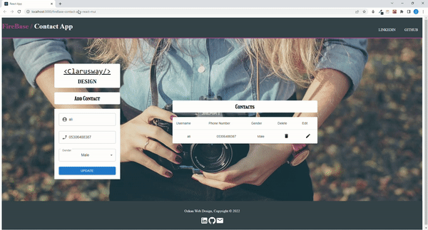

<p align="center">
<a href="https://www.linkedin.com/in/ozkankomu/" target="_blank"></a>
</p>


 FireContact App
## Table of contents

  - [The challenge](#the-challenge)
  - [Screenshot](#screenshot)
  - [Project Skeleton ](#project-skeleton)
  - [Links](#links)
  - [Built with](#built-with)
  - [Useful resources](#useful-resources)
  - [Author](#author)


## The challenge
Project aims to create a Contact App   with React.JS / Fire Base / Toastify / MUİ .  In this project, I used  MUI ,  fire Base  for authantication and dataBase. 


## Project Skeleton

```
007 - FireContact App (folder)
|
|----readme.md       

SOLUTION
├── public
│     └── index.html
├── src
│    ├── components
│    │       ├── form
│    │       │     └── Form.js
│    │       └── table
│    │             └── Table.js
│    ├── utils
│    │       ├── customToastify.js
│    │       └── firebase.js
│    ├── App.js
│    ├── App.css
│    ├── index.js
│    └── index.css
├── package.json
└── yarn.lock

```


## Screenshot
<p align="left">
<a href="https://ozkankomu.github.io/fireBase-contact-app-react-mui/"></a>
</p>


## Links
<hr>
<b>Check The Live Website ➡️</b> <a href="https://ozkankomu.github.io/fireBase-contact-app-react-mui/" target=_blanked> Live Website </a> 
<hr>

### Built with
- REACT
- MUI
- Mobile-first workflow
- Toastify  
- FIRE BASE

## Notes

- I used React - MUI  , FıreBase ,  Toastify , 

### Useful resources

- [W3 Schoold](https://www.w3schools.com/) - This helped me for basics of website paradigm. I really liked this pattern and will use it going forward.
- [MDN](https://developer.mozilla.org/en-US/) - This is an amazing document which helped me finally understand deep sides of web development. I'd recommend it to anyone still learning these concepts.


## Author

- Author - [Ozkan]

<center> &#8987; Happy Coding  &#9997; </center>
